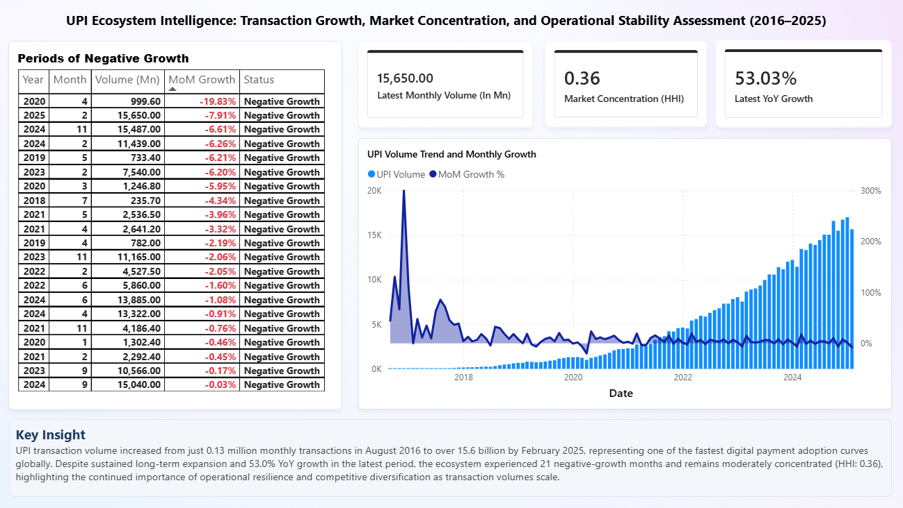
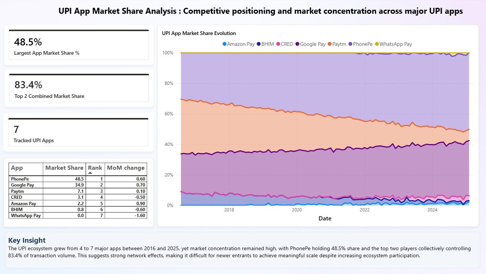
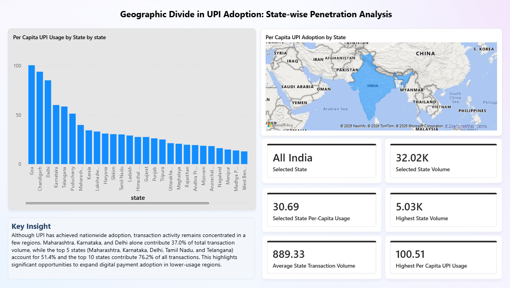
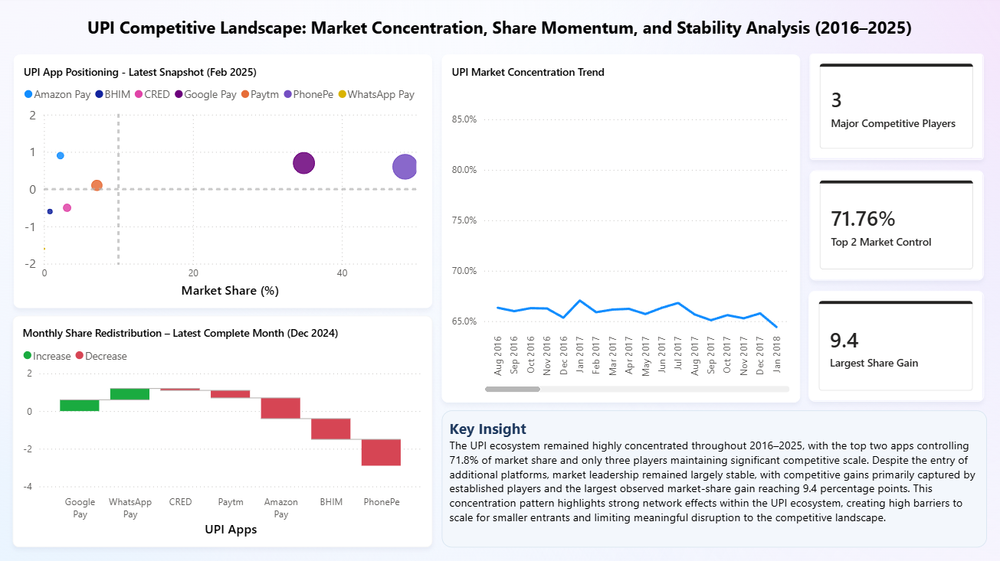
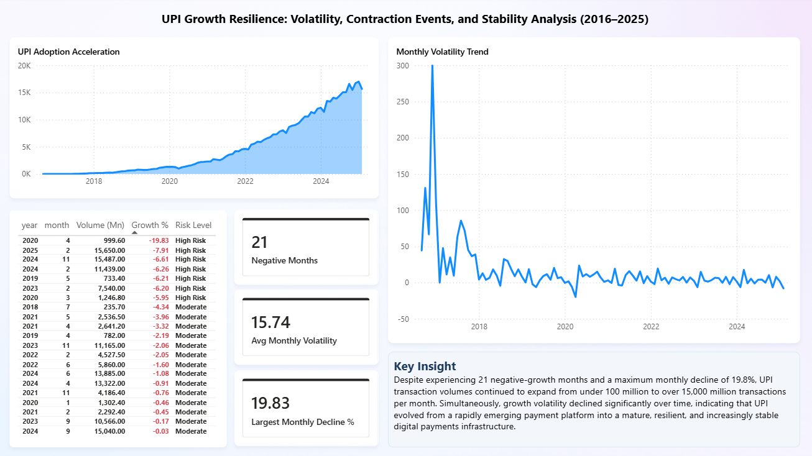
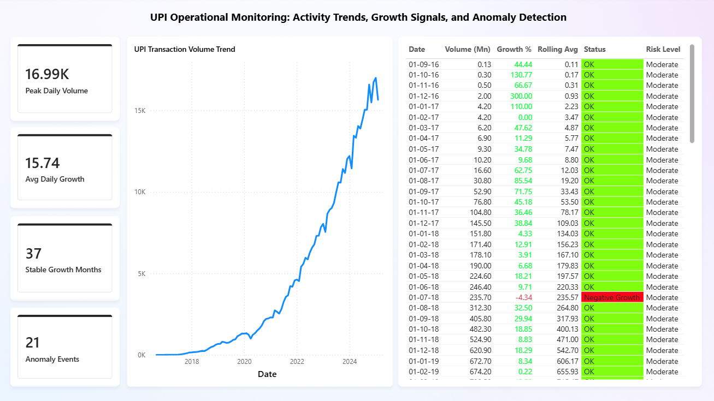

# UPI Ecosystem Intelligence Dashboard (2016–2025)

An end-to-end analytics project examining how India's Unified Payments Interface grew from a new payment platform into one of the largest real-time payment ecosystems in the world, using SQL for data transformation and Power BI for business intelligence.

---

## Project Overview

Most UPI analyses stop at reporting transaction growth. This project goes further.

The dashboard evaluates the UPI ecosystem across six business perspectives: adoption trends, competitive concentration, geographic adoption, market stability, growth resilience, and anomaly detection. The goal was to build something that could inform a real business decision, not just describe what happened.

**Tools used:** SQL · Power BI · DAX

**Dataset:** [Indian UPI Ecosystem Statistics 2016–2025](https://www.kaggle.com/datasets/vedantagarwal0812/indian-upi-ecosystem-statistics-2016-2025) via Kaggle

---

## Dashboard Pages

### 1. Executive Overview

A high-level summary of the entire UPI ecosystem combining transaction growth, market concentration, and operational stability into one view. Built for decision-makers who need a quick read on ecosystem health without going through detailed reports.

**Key metrics:** Latest monthly volume (15,650 Mn) · Market Concentration HHI (0.36) · Latest YoY Growth (53.03%) · Negative Growth Events · Long-term Transaction Trend



> UPI transaction volume increased from just 0.13 million monthly transactions in August 2016 to over 15.6 billion by February 2025, representing one of the fastest digital payment adoption curves globally. Despite sustained long-term expansion and 53.0% YoY growth in the latest period, the ecosystem experienced 21 negative-growth months and remains moderately concentrated (HHI: 0.36), highlighting the continued importance of operational resilience and competitive diversification as transaction volumes scale.

---

### 2. App Market Share Analysis

Looks at how market share has shifted across major UPI apps including PhonePe, Google Pay, Paytm, CRED, BHIM, Amazon Pay, and WhatsApp Pay over the full period.

**Key metrics:** Largest App Market Share · Top 2 Combined Market Share · App Rankings · Monthly Share Changes · Market Share Evolution over time



> The UPI ecosystem grew from 4 to 7 major apps between 2016 and 2025, yet market concentration remained high, with PhonePe holding 48.5% share and the top two players collectively controlling 83.4% of transaction volume. This suggests strong network effects, making it difficult for newer entrants to achieve meaningful scale despite increasing ecosystem participation.

---

### 3. State Adoption Analysis

Breaks down UPI adoption by state using transaction volume and per-capita usage to identify where adoption is strong and where gaps remain.

**Key metrics:** State Transaction Volume · Per-Capita UPI Usage · Highest State Volume · Highest Per-Capita Usage · Geographic Distribution



> Although UPI has achieved nationwide adoption, transaction activity remains concentrated in a few regions. Maharashtra, Karnataka, and Delhi alone contribute 37.0% of total transaction volume, while the top 5 states (Maharashtra, Karnataka, Delhi, Tamil Nadu, and Telangana) account for 51.4% and the top 10 states contribute 76.2% of all transactions. This highlights significant opportunities to expand digital payment adoption in lower-usage regions.

---

### 4. Competitive Landscape Analysis

Goes deeper on market structure by looking at concentration trends, share momentum, and how much redistribution actually happens between players month to month.

**Key metrics:** Major Competitive Players · Top 2 Market Control · Largest Share Gain · Market Concentration Trend · Monthly Share Redistribution



> The UPI ecosystem remained highly concentrated throughout 2016–2025, with the top two apps controlling 71.8% of market share and only three players maintaining significant competitive scale. Despite the entry of additional platforms, market leadership remained largely stable, with competitive gains primarily captured by established players and the largest observed market-share gain reaching 9.4 percentage points. This concentration pattern highlights strong network effects within the UPI ecosystem, creating high barriers to scale for smaller entrants and limiting meaningful disruption to the competitive landscape.

---

### 5. Growth Resilience Analysis

Focuses on what happened during the bad months. Measures how the ecosystem held up during contraction periods, how volatile growth has been, and whether stability has improved over time.

**Key metrics:** Negative Growth Months · Average Monthly Volatility · Largest Monthly Decline · Volatility Trend · Risk Classification



> Despite experiencing 21 negative-growth months and a maximum monthly decline of 19.8%, UPI transaction volumes continued to expand from under 100 million to over 15,000 million transactions per month. Simultaneously, growth volatility declined significantly over time, indicating that UPI evolved from a rapidly emerging payment platform into a mature, resilient, and increasingly stable digital payments infrastructure.

---

### 6. Operational Monitoring Analysis

Built as an operational intelligence view for tracking transaction activity, flagging growth anomalies, and monitoring risk signals on an ongoing basis.

**Key metrics:** Peak Transaction Volume · Average Growth · Stable Growth Months · Anomaly Events · Rolling Average Trend · Risk-Level Monitoring



---

## SQL Techniques Used

The dashboard was built on SQL-generated analytical datasets rather than directly visualizing raw files.

- Window Functions (`LAG`) for month-over-month and year-over-year growth
- Ranking Functions (`RANK`) for competitive positioning
- Rolling Averages for trend smoothing
- Anomaly Detection Logic for flagging negative-growth months
- State-Level Aggregations with per-capita normalization
- Quarterly Rollups for trend segmentation
- Market Share Calculations across apps and time periods

SQL scripts are in the `sql-queries/` folder. Processed outputs are in `data/sql-query-processed/`.

---

## Repository Structure

```
UPI DASHBOARD PROJECT
│
├── dashboard-screenshots/
│   ├── 01_executive_overview.png
│   ├── 02_app_market_share_analysis.png
│   ├── 03_state_adoption_analysis.png
│   ├── 04_competitive_landscape_analysis.png
│   ├── 05_growth_resilience_analysis.png
│   └── 06_operational_monitoring_analysis.png
│
├── data/
│   ├── raw/
│   │   ├── raw_india_digital_payments_comparison.csv
│   │   ├── raw_upi_bank_market_share.csv
│   │   ├── raw_upi_daily_estimates.csv
│   │   ├── raw_upi_fraud_statistics.csv
│   │   ├── raw_upi_monthly_statistics.csv
│   │   └── raw_upi_state_adoption.csv
│   │
│   └── sql-query-processed/
│       ├── monthly_growth_analysis.csv
│       ├── app_market_share_analysis.csv
│       ├── state_adoption_analysis.csv
│       └── quarterly_growth_analysis.csv
│
└── sql-queries/
    ├── 01_monthly_growth_analysis.sql
    ├── 02_market_share_analysis.sql
    ├── 03_state_adoption_analysis.sql
    └── 04_quarterly_growth_analysis.sql
```

---

## Skills Demonstrated

**SQL:** Window functions, ranking, time-series growth calculations, rolling averages, anomaly detection logic, aggregations at multiple levels

**Power BI:** Data modeling, DAX measures, KPI card design, multi-page interactive dashboard, area charts, map visuals, waterfall charts, scatter plots, business storytelling

**Analytics:** Framing business questions before touching data, choosing the right metric for each analysis, communicating findings as insights rather than just observations
